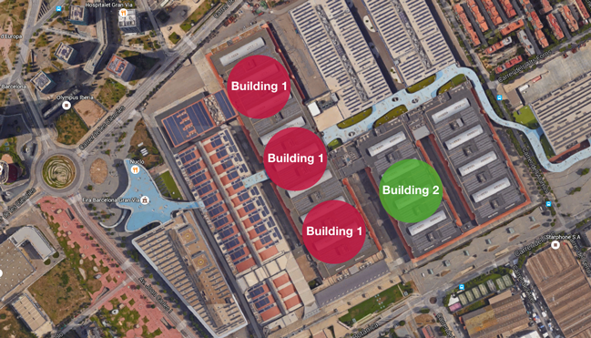

#Hekaerge
A module to sort locations by *tomacco*

- the `Hekaerge` Class allows you to mantain a list of geo locations (`HekaergeLocation`) objects sorted by distance to your current location. 
Current location is fetched **only** via bluetooth beacons, specifically, by the beacons supported by [MOCA Platform](http://mocaplatform.com) Mobile SDKs

###Initializing a Hekaerge object

####iOS
`- (instancetype)initWithLocations: (NSArray<HekaergeLocation *> *) locations`

####Android
` mHk = new Hekaerge(locations);`

####Parameters

- ***locations***: An array of `HekaergeLocation` that will be tracked as users moves around.
 
###Getting the sorted array

- There are two methods to get a sorted array of locations:
	-  One is a **synchronous** method. The first time you instantiate `Hekaerge`, you can try to get a sorted array by calling `getOrderedLocations` just after `Hekaerge` is instantiated for the first time. It will check if there are beacons in range, if there are it will return a sorted array based on the current position. If bluetooth is off, or no beacons are in range, the locations will be get in the same order you provided them to `Hekaerge`
	- Async method; callback via delegation. When the device enters in range of a beacon, MOCA SDK reports it to `Hekaerge` and it, in turn, will return the sorted array to your delegate. Just remember to have a strong reference to your `Hekaerge` instance.

- `Hekaerge` takes account of the radius of the location to measure the distance. As buildings are not circles, you can increase the confidence by creating multiple `HekaergeLocation`s for a building.

- Example:

	- 

####Sorting policies

(relevant for buildings with multiple floors)  
- If two Geofences overlap, and you are inside of both, the **floor** will be used to select the right one.  
- If two Geofences overlap, **with the same floor**, and you are inside both, the smaller one will be sorted first.


####Current limitations
- Alttitude is not used to calculate distance (only a 2D plane).
- Proximity changes in the beacons in range are not used to recalculate distances. (Better performance).

###HekaergeLocation

A `HekaergeLocation` object represents a location. This object incorporates:  
- Identifier: String with name of location
- 2D Coordinate (latitude, longitude)  
- Radius: similar to a GeoFence.  
- Floor: floor level for overlapping geofences.  


###Other

Any improvement you want to make in this module is more than welcome! 😄

Sample Code:

##iOS

```objective-c
@interface MyClass()
{
    Hekaerge  * _go;
}
@end
...
- (void) startHekaerge
{
    HekaergeLocation * hall1 = [[HekaergeLocation alloc] initWithId:@"hall1" latitude:41.353485 longitide:2.129052 floor:0 radius:64];
    HekaergeLocation * hall2 = [[HekaergeLocation alloc] initWithId:@"hall2" latitude:41.354400 longitide:2.129854 floor:0 radius:55];
    HekaergeLocation * hall3 = [[HekaergeLocation alloc] initWithId:@"hall3" latitude:41.355028 longitide:2.131205 floor:0 radius:49];
    HekaergeLocation * hall4 = [[HekaergeLocation alloc] initWithId:@"hall4" latitude:41.354753 longitide:2.13336 floor:0 radius:50];
    HekaergeLocation * hall5 = [[HekaergeLocation alloc] initWithId:@"hall5" latitude:41.356697 longitide:2.132073 floor:0 radius:50];
    HekaergeLocation * hall6 = [[HekaergeLocation alloc] initWithId:@"hall6" latitude:41.355234 longitide:2.134667 floor:0 radius:50];
    HekaergeLocation * hall7 = [[HekaergeLocation alloc] initWithId:@"hall7" latitude:41.357155 longitide:2.133298 floor:0 radius:50];
    HekaergeLocation * hall7Smaller = [[HekaergeLocation alloc] initWithId:@"hall7smaller" latitude:41.357155 longitide:2.133298 floor:0 radius:40];
    HekaergeLocation * hall8 = [[HekaergeLocation alloc] initWithId:@"hall8" latitude:41.3559 longitide:2.136817 floor:0 radius:105];
    HekaergeLocation * hall81 = [[HekaergeLocation alloc] initWithId:@"hall81" latitude:41.3559 longitide:2.136817 floor:1 radius:105];
    NSMutableArray *locs = [[NSMutableArray alloc] init];
    [locs addObject:hall1];
    [locs addObject:hall2];
    [locs addObject:hall3];
    [locs addObject:hall4];
    [locs addObject:hall5];
    [locs addObject:hall6];
    [locs addObject:hall7];
    [locs addObject:hall7Smaller];
    [locs addObject:hall8];
    [locs addObject:hall81];
    
    _go = [[Hekaerge alloc] initWithLocations:locs];
    _go.delegate = self;
    
    NSLog(@"🔴forcing sync...");
    //Forcing first sync with existing data
    [self didChangeLocation:[_go getDefaultLocations]];

}

-(void) didChangeLocation:(NSArray *)locations
{
    int i = 0;
    for(HekaergeLocation* loc in locations){
        NSLog(@"[%i]🔵 %@", ++i, loc.identifier);
    }
}

```

##Android

```java
public class MyClass implements HekaergeListener {

    private Hekaerge mHk;

    ....
    private void hekaergeTest() {
        HkLocation hall1 = new HkLocation("hall1",41.353485,2.129052,0,64.0);
        HkLocation hall2 = new HkLocation("hall2",41.355149,2.131131,0,55.0);
        HkLocation hall3 = new HkLocation("hall3",41.355028,2.131205,0,49.0);
        HkLocation hall4 = new HkLocation("hall4",41.354753,2.13336,0,50.0);
        HkLocation hall5 = new HkLocation("hall5",41.356697,2.132073,0,50.0);
        HkLocation hall6 = new HkLocation("hall6",41.355234,2.134667,0,50.0);
        HkLocation hall7 = new HkLocation("hall7",41.357155,2.133298,0,50.0);
        HkLocation hall8 = new HkLocation("hall8",41.3559,2.136817,0,105.0);
        HkLocation hall81 = new HkLocation("hall81",41.3559,2.136817,1,105.0);

        ArrayList<HkLocation> locations = new  ArrayList<HkLocation>();
        locations.add(hall1);
        locations.add(hall2);
        locations.add(hall3);
        locations.add(hall4);
        locations.add(hall5);
        locations.add(hall6);
        locations.add(hall7);
        locations.add(hall8);
        locations.add(hall81);

        mHk = new Hekaerge(locations);
        mHk.setLocationChangeListener(this);
        //Force first sync
        this.locationDidChange(mHk.getDefaultLocations());
    }

    @Override
    public void locationDidChange(List<HkLocation> locations) {
        int i = 0;
        for(HkLocation loc : locations){
            Log.i("Hekaerge", i++ + "]" + loc.getId());
        }
        Log.i("Hekaerge", "---------------------");

    }
    ...
}
```


